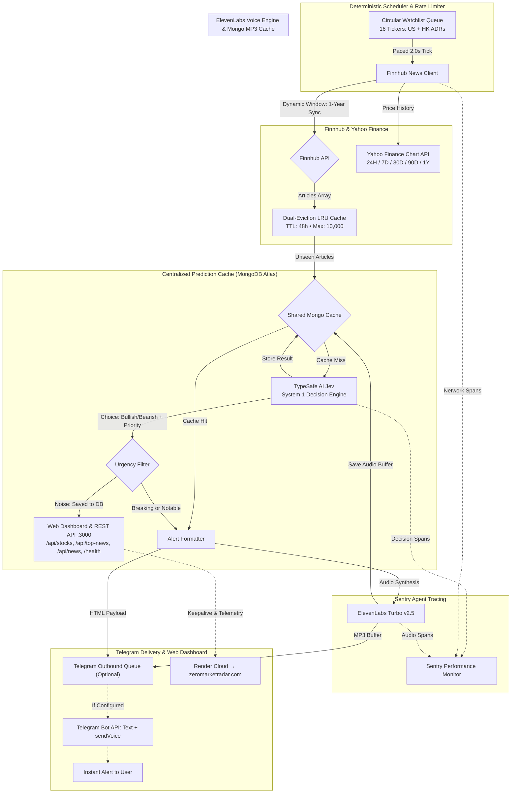

# 📈 Zero Market Radar (`zero-market-radar`)

[](https://zeromarketradar.com)
[](https://render.com/deploy)
[](LICENSE)
[](https://www.typescriptlang.org/)
[](https://nodejs.org/)

> **Hacktoberfest Weekend Challenge: Build for a Friend (`#hf26challenge`)**  
> *Targeted for 4 Challenge Categories: **Best Use of Render**, **Best Use of ElevenLabs**, **Best Use of Sentry Agent Tracing**, and **Best Use of MongoDB Atlas**.*

🌐 **Live at [zeromarketradar.com](https://zeromarketradar.com)** — deployed on Render, open to everyone.

---

## 💡 The Story: Built for a Friend

My friend Alex is an active retail investor who follows a concentrated portfolio of tech equities. He was drowning in financial noise: dozens of clickbait articles, press releases, and commentary every hour across Bloomberg, Yahoo Finance, and CNBC.

He asked for three things:
1. *"I don't need another generative AI writing me 500-word summaries. Just watch my tickers, filter out the noise, and send an instant Telegram alert telling me if breaking news is **Bullish (1)** or **Bearish (0)** with a confidence score."*
2. *"When I'm commuting or driving, send me a 5-second audio voice dispatch so I don't have to look at my phone."*
3. *"Give me a live web dashboard where I can see top ranked stocks by bullish sentiment and listen to the news on demand."*

**Zero Market Radar** is built to solve exactly that. It runs on **Render**, evaluates news through **TypeSafe AI's Jev** (System 1 non-autoregressive decision model), persists predictions to a centralized **MongoDB Atlas** shared cache, generates audio dispatches via **ElevenLabs**, monitors latency with **Sentry Agent Tracing**, and delivers alerts straight to Alex's Telegram while serving a live Web Dashboard.

---

## ⚡ Why System 1 Decision Models Beat Generative LLMs

Traditional generative LLMs (like GPT-4 or Claude) are poorly suited for streaming event-driven financial pipelines:
1. **Latency:** LLM autoregressive token generation takes 2,000–5,000ms. Jev takes **sub-second inference**.
2. **Hallucination & Schema Breakage:** LLM "prompt-and-parse" JSON output frequently fails under high volume or unexpected punctuation.
3. **Calibrated Confidence:** Generative LLMs cannot reliably quantify their own uncertainty. Jev's System 1 model computes true calibrated probabilities and confidence metrics across discrete decision boundaries.

```
Breaking News Article ──► Jev System 1 Decision ──► Typed Binary Signal [0/1] + Confidence
```

---

## 🏗 System Architecture



---

## 🌐 Live Web Dashboard, Symbol Pages & REST API

**Live at [zeromarketradar.com](https://zeromarketradar.com)** — deployed on Render.

The service embeds a dark-mode web application and REST API:

* **Dedicated Symbol Pages (`/symbol/:symbol`):**
  - **TradingView Lightweight Charts Price Chart:** High-performance interactive chart with `24H`, `7D`, `30D`, `90D`, `1Y` range selector powered by [`lightweight-charts`](https://github.com/tradingview/lightweight-charts).
    - **Published News Dots on Chart:** Breaking and notable catalyst events are plotted on the price line, interpolated between bars: 🟢 **Emerald Green** for Bullish signals, 🔴 **Rose Red** for Bearish signals, and a glowing outer halo for 🔥 **Breaking Critical** news. News outside available price history (such as weekend news after Friday's close) anchors to the nearest price bar; tooltips retain the true publication time and identify the price anchor. Routine news remains in the list without chart dots.
  - **Rich Hover Tooltips:** Hovering over any dot opens a frosted-glass tooltip card showing headline, priority badge, sentiment signal, confidence %, impact %, bull/bear probability split, and a click-to-jump CTA. Smart edge-detection flips the tooltip below the dot when near the top of the chart.
  - **Click-to-Jump Navigation:** Clicking a dot automatically navigates to the correct pagination page and smooth-scrolls to the article with an animated neon highlight flash.
  - **Unified Filter Bar (Chart + News):** A single filter strip above the chart controls both dot visibility and the news list simultaneously — filter by `All`, `🔥 Breaking`, `⚡ Catalysts`, `🟢 Bullish`, `🔴 Bearish`. Sort by Latest, Highest Urgency, or Confidence. Inline headline search.
  - **Paginated News Feed (10 per page):** Prevents infinite scroll overload on heavy watchlists. Page navigation resets on every filter or sort change.
* **Real-Time Price Telemetry:** Watched stocks display live prices, dollar changes, and percent changes fetched via Finnhub `/quote` alongside sentiment telemetry.
* **Interactive Interest Symbols Filtering:** Multi-select ticker selector with quick presets (Mega Tech, Semis, China/HK ADRs) and instant search, persisted in `localStorage`.
* **Top Impact News Spotlight:** Dedicated hero spotlight section (`/api/top-news`) highlighting high-urgency catalysts and breaking announcements across your selected interest symbols.
* **Order by Impact / Urgency:** Sort breaking news by TypeSafe Jev `urgencyScore` (Impact), chronological date, or model confidence.
* **Dynamic Date Range Filtering:** Quick date range selectors (`3D` default, `24H`, `7D`, `30D`, `1Y`) and custom date range pickers.
* **ElevenLabs Audio Playback:** Click "🎙 Listen with ElevenLabs" on breaking news cards (`BREAKING_CRITICAL` only) to stream voice synthesis directly in the browser with live animated audio waves. Catalyst alerts are text-only.
* **Render Telemetry:** Live health status (`/health`), rate-limit consumption (~27 req/min), and cache hit metrics.

---

## 🛡 Production Engineering Features

1. **Shared Finnhub Request Pacing:**
   - Free tier limit is 60 requests/minute.
    - Each symbol poll fetches both a quote and company news. All Finnhub requests, including dashboard fallbacks and retries, share a serial queue with at least `1,200ms` between request starts (at most 50/min per service instance).
    - A `429` pauses the shared queue for at least 60 seconds, or longer when required by `Retry-After`. The scheduler waits `POLL_INTERVAL_MS` after each completed poll rather than bursting through overdue ticks.
    - Run one service replica per Finnhub API key. Local runs or overlapping Render deployments sharing that key can still exhaust the upstream quota; multiple replicas require a distributed limiter or separate keys.
2. **Centralized MongoDB Shared Cache & Startup Warm-Up:**
   - On boot, loads recent article IDs directly into the in-memory LRU cache, guaranteeing zero duplicate alerts across container restarts or Render redeployments.
   - Predictions and synthesized ElevenLabs MP3 binaries are persisted in MongoDB Atlas, sharing model decisions and audio buffers across instances.
   - Falls back gracefully to an in-memory store if `MONGODB_URI` is omitted.
3. **ElevenLabs Voice Alerts via Telegram `sendVoice`:**
    - High-confidence breaking alerts (`BREAKING_CRITICAL` only) generate audio broadcasts via ElevenLabs' low-latency `eleven_turbo_v2_5` model, sent as voice memos with HTML captions. Notable catalysts continue to receive text alerts.
4. **Sentry Agent Tracing:**
   - Instruments OpenTelemetry trace spans across Jev decisions, Finnhub polling, and ElevenLabs audio generation to monitor decision latency and token efficiency.
5. **Dynamic Incremental Sync & Historical Backfill (`HISTORY_SYNC_DAYS`):**
   - **First Run:** Queries Finnhub for the past 7 days (configurable via `HISTORY_SYNC_DAYS`, default 7) of news across each ticker, seeds Jev predictions, and populates the dashboard silently.
    - **Subsequent Runs:** Tracks inclusive UTC dates `syncedFrom` and `syncedTo` per symbol in MongoDB's `sync_metadata`. Downtime gaps are fetched from `syncedTo` (with a one-day overlap) through today.
    - **Expanded History:** Changing `HISTORY_SYNC_DAYS` from 3 to 365 backfills from one year ago through the existing `syncedFrom` (three days ago), silently reusing cached predictions. Live polling resumes on the next tick. Reducing the setting never shrinks recorded coverage.
    - **Legacy Metadata:** Timestamp-only records are re-seeded once for the configured window because `lastSyncedAt` alone cannot prove historical coverage. Coverage advances only after successful fetches and processing, including valid empty news ranges.
   - **Continuous Live Polling:** Rolls continuously over the active window, alerting breaking news in sub-second latency.
6. **Unified News Priority & Urgency Scoring:**
   - TypeSafe Jev evaluates a unified multi-choice `news_priority` decision alongside directional sentiment in a single sub-second evaluation:
     - `BREAKING_CRITICAL`: Unscheduled, high-volatility events (earnings surprises, CEO resignations, regulatory bans) trigger urgent push alerts and ElevenLabs audio broadcasts.
     - `NOTABLE_CATALYST`: Business updates, analyst upgrades/downgrades, and partnerships trigger standard alerts.
     - `ROUTINE_NOISE`: General commentary, opinion columns, and retrospective wrap-ups are safely filtered out of push alerts while staying searchable on the dashboard.
     - Continuous `urgencyScore` ($0.0 - 1.0$) ranks top news across all watchlists.
7. **Outbound Telegram Throttling with Strict HTML Escaping:**
   - Strict HTML escaping for `&`, `<`, and `>` ensures messages never fail on ticker symbols or financial punctuation (e.g. `AT&T`, `S&P 500`, `P/E > 25`).
8. **Durable Price History for Future Backtests:**
    - The poller archives **all daily history available from Yahoo** for each watched symbol, independent of dashboard traffic and `HISTORY_SYNC_DAYS`. It reconciles the full daily series once every 24 hours to catch downtime and provider corrections; this is not a guarantee of complete exchange history.
    - Dashboard requests also retain provider-supplied **15-minute** (`24H`) and **hourly** (`7D`) candles, plus daily bars for longer ranges. Intraday retention starts with fetched data; unavailable older intraday history cannot be reconstructed from daily bars.
    - MongoDB `price_candles` holds one OHLCV document per `symbol + interval + timestamp`, with a unique compound index, `provider`, `fetchedAt`, and `adjustedClose` when supplied. Upserts correct overlapping bars without deleting older history. Prices retain provider precision. There is no Mongo expiry/TTL on archived candles.
    - `price_history_metadata` records the last successful fetch and its returned bounds. Shared in-memory caching holds at most 100 windows, expires chart windows after five minutes, and coalesces concurrent requests. Refresh failures retry after one minute and serve labeled stale candles when available; synthetic quote-based history is never generated or stored.
    - With MongoDB unavailable/unconfigured, fallback memory retains at most 100 series with 20,000 bars each and is **not durable**. Configure `MONGODB_URI` to build the archive across restarts.
    - These are the provider's **latest revised candles**, not point-in-time versions. Future backtests must account for corporate actions, survivorship/look-ahead bias, provider coverage and licensing; a timestamped fetch does not prove what data was available historically. A backtest engine is not included.

---

## 🚀 Deployment to Render

The live service runs at **[zeromarketradar.com](https://zeromarketradar.com)**.

Deploy your own instance directly to Render with one click:

[](https://render.com/deploy)

Render reads [`render.yaml`](render.yaml) automatically to configure the web service with automated health checks on `/health`.

---

## ⚙️ Configuration & Environment Variables

> 💡 **Need help getting API keys?** See our step-by-step [API Keys & Environment Setup Guide](API_KEYS.md) for direct links and walkthroughs to obtain free keys for Finnhub, TypeSafe AI, Telegram, ElevenLabs, MongoDB Atlas, and Sentry.

| Variable | Required | Default | Description |
| :--- | :---: | :---: | :--- |
| `FINNHUB_API_KEY` | **Yes** | — | Finnhub API Key for financial news |
| `TYPESAFE_API_KEY` | **Yes** | — | TypeSafe AI API Key for Jev decision model |
| `TELEGRAM_BOT_TOKEN` | No | — | Optional Telegram Bot token (`<bot_id>:<token>`) for push alerts |
| `TELEGRAM_CHAT_ID` | No | — | Optional target Telegram Chat ID (omitted = dashboard-only mode) |
| `MONGODB_URI` | No | — | MongoDB Atlas connection string for centralized cache |
| `ELEVENLABS_API_KEY` | No | — | ElevenLabs API Key for voice note alerts |
| `ELEVENLABS_VOICE_ID` | No | `pNInz6obpgDQGcFmaJgB` | ElevenLabs Voice ID (Adam - financial broadcast) |
| `ENABLE_VOICE_ALERTS`| No | `true` | Enables ElevenLabs voice note alerts in Telegram |
| `SENTRY_DSN` | No | — | Sentry DSN for Agent Tracing & performance monitoring |
| `WATCHLIST` | No | AAPL,MSFT,NVDA,GOOGL,AMZN,META,TSLA,AMD,TSM,PLTR,NFLX,BABA,TCEHY,BYDDY,PDD,XIACY | Comma-separated list of ticker symbols |
| `POLL_INTERVAL_MS` | No | `2000` | Paced interval between ticker polls (30 req/min) |
| `MIN_CONFIDENCE` | No | `0.50` | Minimum confidence cutoff (0.0 to 1.0) |
| `HISTORY_SYNC_DAYS` | No | `7` | Historical lookback window in days for initial sync (1 to 1825) |
| `PORT` | No | `3000` | HTTP port for web dashboard & health check |

---

## 🧪 Testing

```bash
npm test
```

Unit tests verify:
- Bounded LRU Cache capacity and TTL expiration
- Telegram HTML entity escaping (`&`, `<`, `>`) and priority banner rendering
- Centralized MongoDB prediction caching and top stocks ranking
- Confirmed sync range tracking (`getSyncMetadata` / `setSyncRange`), expanded lookbacks, and failed-sync retries
- ElevenLabs synthesized audio buffer caching and retrieval
- Environment validation, optional Telegram fallback, and `HISTORY_SYNC_DAYS` boundary constraints
- Multi-symbol interest filtering, date range lookbacks, and impact-based ordering
- Web server endpoints (`/health`, `/api/stocks`, `/api/top-news`, `/api/news`) and HTML rendering
- Telegram alert graceful degradation when credentials are omitted

---

## 📄 License

This project is licensed under the [MIT License](LICENSE).
